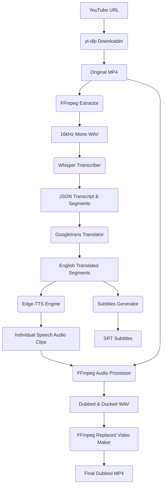

# Automated Video Dubbing System (Production Grade)

An advanced, production-quality AI pipeline designed to translate and dub any YouTube video into natural, timing-aligned English speech while retaining original background audio, sound effects, and music.

## Key Features
- **Segment-Level Synchronization**: Translates and synthesizes audio on a per-segment basis using Whisper timestamps to eliminate drift.
- **Dynamic Speed Adaptation**: Adjusts synthesized speech durations automatically using FFmpeg `atempo` time-stretching to prevent overlaps.
- **Background Sound Preservation**: Implements volume-envelope based **audio ducking** to reduce the original track volume to 15% *only* during active voice periods, leaving background sound effects and music intact.
- **SRT Subtitle Generation**: Auto-creates formatted English `.srt` subtitles synchronized with the video.
- **Asynchronous TTS Synthesis**: Parallelizes Voice requests via Edge-TTS with concurrency limiting (asyncio semaphore) to avoid HTTP request throttling.
- **JSON Metrics Reporting**: Generates a thorough `report.json` on execution summarizing duration, input language, timings, output files, and configuration parameters.

---

## Architecture Diagram



---

## Folder Structure

```
automated-video-dubbing/
├── run.py
├── config.py
├── requirements.txt
├── README.md
├── .gitignore
├── .env.example
├── input/
│   ├── videos/
│   ├── audio/
│   └── transcript/
├── output/
│   ├── dubbed_videos/
│   ├── english_audio/
│   ├── translated_text/
│   ├── subtitles/
│   └── logs/
└── src/
    ├── downloader/
    │   └── youtube_downloader.py
    ├── audio/
    │   ├── extract_audio.py
    │   └── replace_audio.py
    ├── transcription/
    │   └── whisper_transcriber.py
    ├── translation/
    │   └── translator.py
    ├── tts/
    │   └── edge_tts_engine.py
    └── utils/
        ├── logger.py
        ├── helpers.py
        ├── timer.py
        └── ffmpeg_utils.py
```

---

## Installation & Setup

### 1. System Requirements
You must have Python 3.8+ and **FFmpeg** installed on your system.
```bash
# Ubuntu/Linux
sudo apt update && sudo apt install ffmpeg -y

# MacOS
brew install ffmpeg
```

### 2. Setup Virtual Environment
```bash
# Clone the repository and navigate inside
cd automated-video-dubbing

# Create virtual environment
python3 -m venv venv
source venv/bin/activate

# Install requirements
pip install -r requirements.txt
```

### 3. Environment Variables (`.env`)
Create a `.env` file in the root directory to customize parameters:
```env
WHISPER_MODEL=base
EDGE_TTS_VOICE=en-US-GuyNeural
LOG_LEVEL=INFO
OUTPUT_LANGUAGE=en
```

---

## Usage

The system supports two execution modes:

### 1. Interactive CLI Mode
Run the command-line interface:
```bash
python run.py
```
1. Enter the YouTube URL when prompted.
2. The pipeline will execute sequentially and show logs in the console.
3. The final dubbed video will be saved to `output/dubbed_videos/<video_name>_english.mp4`.
4. Subtitles will be saved to `output/subtitles/video.srt`.
5. The execution report will be saved to `output/report.json`.

### 2. Streamlit Web UI Mode
Run the premium web application:
```bash
streamlit run app.py
```
This launches a modern dashboard in your web browser with features including:
- Dark theme
- Custom inputs for URL, Whisper model, and Output Voice
- Real-time progress bar & live logs display
- Built-in video player to preview the dubbed video
- Direct download buttons for the video, subtitles, and JSON report.

---

## Screenshots Placeholder


---

## Output Examples & Reports
After running the script, the system creates a report in `output/dubbed_videos/` containing details such as:
```json
{
    "execution_timestamp": "2026-07-19T13:54:10",
    "status": "SUCCESS",
    "video": {
        "name": "Sample Spanish.mp4",
        "duration_seconds": 12.4
    },
    "languages": {
        "detected_input_language": "es",
        "output_language": "en"
    },
    "performance": {
        "total_processing_time_seconds": 32.54
    },
    "configurations": {
        "whisper_model": "base",
        "voice_model": "en-US-GuyNeural"
    }
}
```

---

## Known Limitations
- **Googletrans Stability**: `googletrans` uses an unofficial Google Translate API wrapper which might lead to rate-limiting blocks during massive transcripts.
- **Max Speed Capping**: Capping at `2.0x` speed prevents fast talking overlap but may slightly displace long sentences.

## Future Improvements
- Integrate **DeepL** or **IndicTrans2** for professional-grade document translations.
- Implement **Speaker Diarization** using PyAnnote to dub different speakers with different Edge-TTS voices.
- Use **demucs** to separate vocal track and background music instead of relying solely on ducking filters.

## Credits & License
- Project developed under MIT License.
- Built using: `openai-whisper`, `yt-dlp`, `edge-tts`, and `ffmpeg`.
